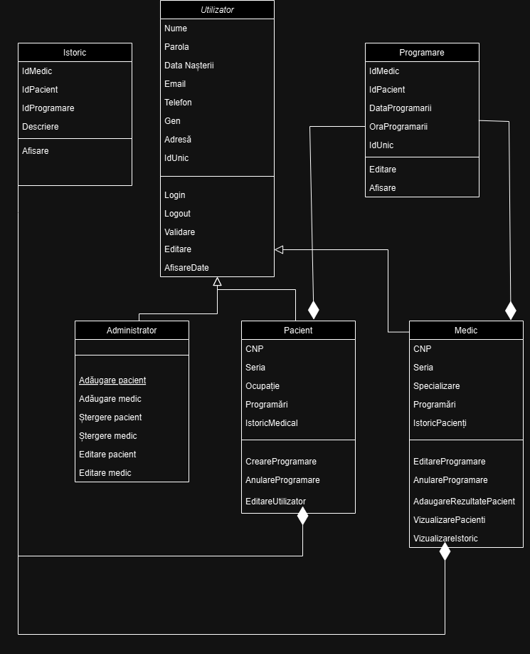

# Sistem de gestionare a unei clinici medicale
### Mihali Iuliana-Călina

## Descriere
O aplicație desktop cu interfață grafică care permite inregistrarea atât a pacienților cât și a medicilor. Fereastra de LogIn va conține opțiunea de a selecta tipul de user pentru logare (pacient sau medic). Sistemul va permite medicilor opțiunile de vizualizare a programărilor, adăugare, ștergere și editarea pacienților. Vizualizarea programărilor curente o să fie sub formă de tabel și va conține numele pacientului, descrierea problemei și data programării. Pentru vizualizarea programarilor finalizate (istoric), datele vor fi afișate sub formă de tabel, optional pentru o vizualizare mai ușoară, programările vor fi evidențiate în culori distincte, în funcție de an, astfel încât fiecare an să fie reprezentat printr-o culoare diferită. Editarea pacienților va consta în adăugarea rezultatelor analizelor, a consultațiilor, prescripția medicală, precum și adăugarea diagnosticelor. Pentru pacienți sistemul va permite selectarea specialității, a serviciului dorit pentru a realiza o programare, precum și afișarea medicilor din specialitatea dorită. De asemenea, pacientul poate sa vizualizeze istoricul programărilor cât și cel medical conținănd rezultatele în urma investigațiilor. Atât pacienții, cât și medicii vor putea să își editeze profilul, precum numele, numarul de telefon, parola, adresa de domiciliu și adresa de e-mail.
Aplicația va asigura o interfață intuitivă și accesibilă atât pentru pacienți cât și pentru medici, ușurând gestionarea programărilor și a istoricului medical.

## Obiective
* interfață mai ușor de gestionat pentru utilizatori
* acces rapid și organizat la istoricul medical incluzând:
    - programări anterioare, viitoare
    - rezultate analize
    - afișarea diagnosticului
    - prescriere de medicamente
* afișare clară a prețurilor pentru fiecare specialitate medicală, astfel încât pacienții să știe costurile înainte de a face o programare

## Arhitectura

## Functionalitati/Exemple utilizare
* Creare cont
* Afișare pacienți
* Afișare medici
* Adăugare pacienți
* Adăugare medici
* Afișare a specialităților medicale
* Creare programare
* Afișare istoric
* Editare profil

